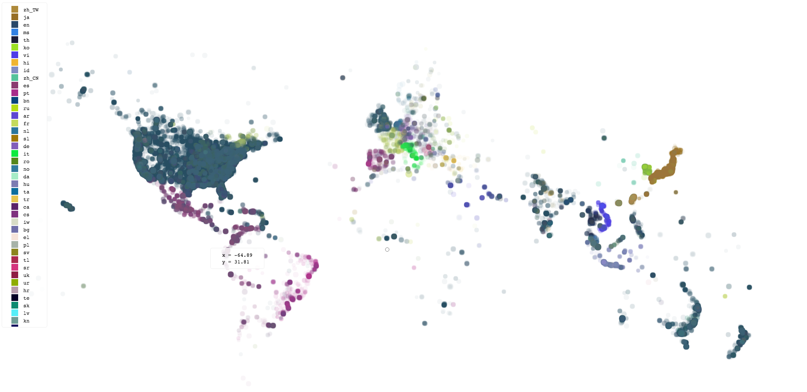
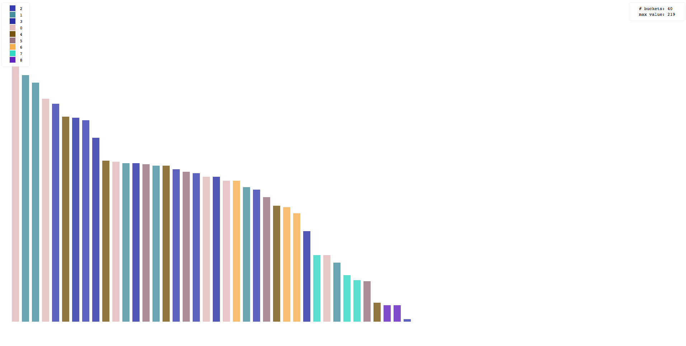

# vzi

*vzi* is the spiritual successor to [viz ](https://github.com/jflatow/viz)

*vzi* command line is (now) implemented using [deno](https://deno.com/), and rendering requires the [Chrome DevTools Protocol](https://chromedevtools.github.io/devtools-protocol/1-3/Page/).
*vzi* has only been tested for Mac, although it should trivially work on Linux (just tell it the path to the Chrome binary).

## About

Many of us have been using the command line for decades.
The success of the command line interface is intimately tied to the idea of *Unix* pipes.
Pipes give us the ability to compose complex functions on the fly, tailored to the needs of the input data we are manipulating.
For this purpose, the shell is the highest bandwidth input mechanism that humans have yet invented to instruct machines.

And yet, we have no good way of piping data into that other highly dynamic environment in which we spend a great deal of time: the browser.
The goal of *vzi* is to bridge that gap, so we can include web-based compositions as part of our cherished data pipelines.

Looking at data in the terminal, we often have no good way to interpret it, yet with some slight transformation, our eyes are able to comprehend deep patterns.
Given a source of data that contains latitude and longitude coordinates, a natural way to explore this data is using a map.
You can do that with *vzi* by piping the data to it, e.g.:

```
$ your data source | vzi -m scatter -d 'y=lat($[0])' -d 'x=lng($[1])' -d c=2
```

Here is a screenshot of the state produced by using the above command with lines of data of the form `latitude longitude language`:



The actual report state produced by *vzi* at any given time is a complete and full-fledged web page, much richer than a static image.
If you choose, the final (or intermediate) report state(s) can be saved, or you may simply wish to interact with it temporarily inside the browser, ignoring the output.
Either way, *vzi* makes data analysis sessions more fun and productive.

Another type of visualization that comes builtin is the `bucket` module.
Below is a screenshot of the report produced by the command:

```
$ bin/gen-yxz | vzi -m hist -d c=2
```



Modules can reuse code from each other.
The above command is actually equivalent to the command:

```
$ bin/gen-yxz | vzi -m bucket -d c=2 -d orderBy=freq
```

The `scatter` and `bucket` modules are rather general and can be used to great effect in any number of situations.
However, it is easy to write other [pipe](#pipes) modules, and doing so can in fact be quite an enjoyable exercise.

## Install

First, install [Chrome Canary](https://www.google.com/chrome/browser/canary.html).
It's not strictly required, but its the best and easiest way to use *vzi* currently.

You can install the command line tool globally with [deno](https://deno.land/manual/tools/script_installer) using:

```
deno install -A -f https://raw.githubusercontent.com/jflatow/vzi/master/bin/vzi
```

A better method for developers is to clone the repository and install it:

```
$ git clone https://github.com/jflatow/vzi.git
$ cd vzi && make install
```

Quickly test it works:

```
$ vzi
```

It should open a window in the browser.
If not, you may need to use the `-b` option to tell *vzi* where the browser executable path is.
For a complete list of options: `vzi -h`.

If Canary is already launched without the remote debugging port open, you *may* get an error when *vzi* requests a new page (i.e. `/json/new`).
In that case, just quit Chrome and let *vzi* launch it the way it wants, or re-open it yourself with the port open.
The default port used by *vzi* is `9222`, but you can specify it using the `-p` option.

With the browser window still open, on the *stdin* pipe that is open to the browser, you can type a message:

```
> hello, world!
```

Make sure you enter a newline at the end, so that the line is complete.
Back in the open browser window, you should see your message in the document body.
Enter as many lines as you like, each one updates the document.
When you are done, close the pipe using `^D`.

If you've cloned the *vzi* repo directory, you can try this from inside it:

```
$ bin/gen-yxz | vzi -m scatter -d c=2
```

## Usage

By default *vzi* will produce a single, final, report document on *stdout*.
The pipe that gets executed by *vzi* (via *Chrome*) defines what happens to the browser state as new events are received.

There are three ways to tell *vzi* how to execute its pipe:
 1. Pass the name of a file containing a handler as an argument
 2. Pass the script directly using the `-c, --cli` option
 3. Pass the name of a builtin module using the `-m, --module` option

```
$ cat events | vzi pipe.js
$ cat events | vzi -c '...'
$ cat events | vzi -m module
```

If the `-K, --keep-alive` option is given, *vzi* will not attempt to close the browser.
The `-OK` can be used together for a quiet, interactive session.

If the `-O, --no-output` option is given, output will be disabled.
If the `-o, --output` option is given, *vzi* will write its report state to the output path after every batch of events.
In this way, one can watch the output file for changes in order to observe the recent state of the pipeline (e.g. when running headless).
If neither `-o` nor `-O` are specified, only the final state is written to *stdout*.

```
$ cat events | vzi pipe.js -O
$ cat events | vzi pipe.js -o report.html
$ cat events | vzi pipe.js > report.html
```

One may also control the mechanism *vzi* uses for rendering the events using the `-p, --port` option.
If given, the port is assumed to speak the DevTools wire protocol (e.g. a browser with remote-debugging enabled).
If the `-p` option is not given, *vzi* will create its own browser for rendering.

```
$ cat events | vzi pipe.js
$ cat events | vzi pipe.js -p PORT
$ cat events | vzi pipe.js -p PORT > report.html
```

The `-H, --headless` option may be given to force *vzi* to create a headless browser.
This requires a browser capable of being run headlessly (NB: *Chrome Canary* at the time of this writing).

```
$ cat events | vzi pipe.js -H
```

Running headlessly is considered a rather advanced mode of operation, though it works quite well.
In general, there are 2 modes of operation for the browser: *attached* and *detached*.
When you run detached (default if not headless), things are a bit easier and smoother to get started.
Especially when you run without headless, since you can see exactly what's happening.
In the attached mode, interrupts end up killing the browser, so unless you send a proper EOF you won't get an output report.
This is still fine without headless, since you still see the output in the browser as its generated.
However, when you run in headless mode attached, you generally don't want to pipe an infinite stream.
This is because without an EOF you won't be able to kill the process gracefully, so you will neither see the output nor get a report.

Some of the available options may be confusing without an understanding of how the tool works.
The overall setup is complex yet straightforward.
Once the DevTools implementation is known, a page is opened and the events are sent via a layer on top of the Chrome debugging protocol.
Within this context, the user-defined pipe handler functions are executed.

## Pipes

There are two key interfaces that *vzi* provides.
One is the specification of how an output *report* gets produced.
The other is the environment in which user-defined functions are run, and the callbacks that are used.
We call the user-defined logic that executes in this environment the *pipe*.
The pipe handles the visualization logic for the *Unix* pipe that it runs inside.

The pipe interface is currently defined in [index.js](www/index.js).
The best examples are the builtin modules, listed here in order of complexity:

 - [echo](lib/www/echo.ts)
 - [rate](lib/www/rate.ts)
 - [table](lib/www/table.ts)
 - [hist](lib/www/hist.ts)
 - [bucket](lib/www/bucket.ts)
 - [scatter](lib/www/scatter.ts)
 - [sankey](lib/www/sankey.ts)

## Examples

Here are some other quick examples you can try, assuming you've cloned the repository:

```
bin/gen-yxz | vzi -m scatter -d y='log($[0])' -d ys='exp(_)'
bin/gen-line | vzi -m hist -d v=1 -d k='second((new Date - 0) / 1000, 3)'
```
